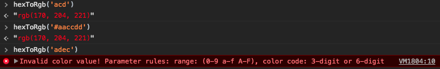
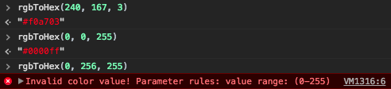

# JavaScript Tricks

## Table of Contents

* [*Color Converts*](#color-converts)
    > `hexToRgb()`, `rgbToHex()`
* [*Checks Argument Type*](#checks-argument-type)
    > `isObj()`, `isArray()`, `isFunc()`, `isBool()`, `isRegExp()`
* [*String To Boolean*](#string-to-boolean)
* [*Set/Get localStorage*](#set-or-get-localstorage)
    > `setStorage()`, `getStorage()`
* [*Set/Get Cookie*](#set-or-get-cookie)
    > `setCookie()`, `getCookie()`
* [*Object Has*](#object-has)
* [*Random HexColor*](#random-hexcolor)

## Methods

### Color Converts

> `Hex color` <=> `RGB`

```js
const hexToRgb = hex => {
    let _hex = /^#/.test(hex) ? hex.slice(1) : hex
    if(/^(3|6)$/.test(_hex.length)) {
        let h = parseInt(_hex.length === 3
            // Array.prototype.map.call()
            ? [..._hex].map(i => i + i).join('')
            : _hex, 16)
        return  `rgb(${h >> 16}, ${(h & 0x00ff00) >> 8}, ${h & 0x0000ff})`
    } else {
        console.error('Invalid color value! Parameter rules: range: (0-9 a-f A-F), color code: 3-digit or 6-digit')
    }
}
// hexToRgb('acd') => "rgb(170, 204, 221)"
// hexToRgb('#aaccdd') => "rgb(170, 204, 221)"
// hexToRgb('adec') => 'Invalid color value! ...'

const rgbToHex = (r, g, b) => {
    const isRange = val => 0 <= val && val <= 255
    return isRange(r) && isRange(g) && isRange(b)
        ? '#' + ((r << 16) + (g << 8) + b).toString(16).padStart(6, '0')
        : console.error('Invalid color value! Parameter rules: value range: (0-255)')
}
// rgbToHex(240, 167, 3) => '#f0a703'
// rgbToHex(0, 0, 255) => '#0000ff'
// rgbToHex(0, 256, 255) => 'Invalid color value! ...'
```




[☝︎ Back To TOP](#table-of-contents)

### Checks Argument Type

> Checks if the given argument type.

```js
const is = (val, type) => Object.prototype.toString.call(val) === `[object ${type}]`
const isObj = val => is(val, 'Object')
const isArray = val => is(val, 'Array')
const isFunc = val => is(val, 'Function')
const isBool = val => is(val, 'Boolean')
const isRegExp = val => is(val, 'RegExp')
```

[☝︎ Back To TOP](#table-of-contents)

### String To Boolean

> Converts a string to boolean.

```js
const toBool = val => /^true$/i.test(str)
```

[☝︎ Back To TOP](#table-of-contents)

### Set Or Get LocalStorage

> Set/Get localStorage, using methods: [`isObj()`, `isArray()`](#checks-argument-type), [`toBool()`](#string-to-boolean)

```js
// Set localStorage
/**
* @parma {String} key
* @parma {Any} val - [Number | Object | Array]
*/
const setStorage = (key, val) => localStorage.setItem(key, isObj(val) || isArray(val) ? JSON.stringify(val) : val)

// Get localStorage
const getStorage = key => {
    let _key = localStorage.getItem(key)
    let _ = {
        int: /^-?\d+$/,
        float: /^(-?\d+)(\.\d+)$/,
        bool: /^(true)|(false)$/,
        obj: /^\[?\{|\}\]?$/
    }
    const match = str => str.test(_key)
    if(match(_.int)) return parseInt(_key)
    if(match(_.float)) return parseFloat(_key)
    if(match(_.bool)) return toBool(_key)
    if(match(_.obj)) return JSON.parse(_key)
}
```

[☝︎ Back To TOP](#table-of-contents)

### Set Or Get Cookie

> Set/Get Cookie

```js
// Set Cookie
const setCookie = (key, val) => document.cookie = `${key}=${val}`

// Get Cookie
const getCookie = key => {
    return document.cookie.split(';').map(i => {
        let _v = i.trim()
        return new RegExp(`^${key}=`).test(_v)
            ? _v.substr(`${key}=`.length, _v.length) : void 0
    }).join('')
}
```

[☝︎ Back To TOP](#table-of-contents)

---

### Object Has

> Checks if `key` is a direct property of `object`.

```js
const objHas = (obj, key) => obj !== null && Object.prototype.hasOwnProperty.call(obj, key)
```

[☝︎ Back To TOP](#table-of-contents)

### Random HexColor

> Generates a random hexadecimal color code.

```js
const randomHexColor = () => {
    let n = (Math.random()*0xffffff|0).toString(16)
    return '#' + (n.length !== 6
        ? '0'.repeat(6 - n.length) + n : n)
}

// test
/*
for(let i=0; i<1000; i++) {
    let a = randomColor()
    if(a.length < 7) {
        console.log(a)
    } else {
        console.log(a.length)
    }
}
*/
```

[☝︎ Back To TOP](#table-of-contents)
