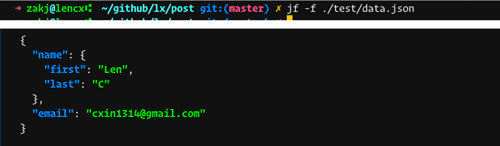
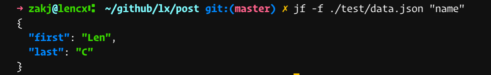
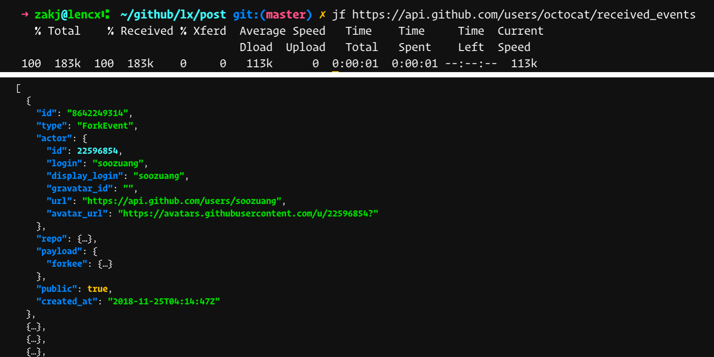
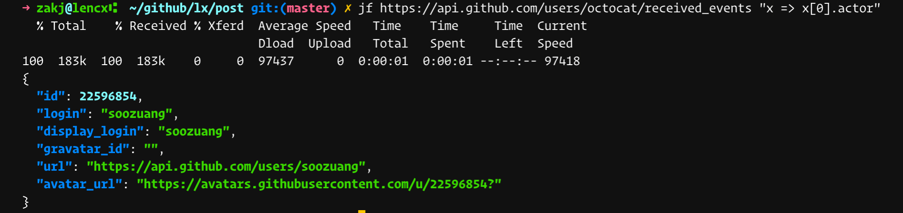

# Terminal JOSN Data Formatting & Highlighting

> [cmd-json](/shell/cmd-json.sh)

## [Environmental](../../env.md)

```bash
# node
npm install -g fx
```

## Usage

```bash
# .zshrc
. ~/your_path/cmd-json.sh

# example
jf https://api.github.com/users/octocat/received_events

jf https://api.github.com/users/octocat/received_events "x=>x[0].actor"

jf -f ./<your_path>/<file_name>.json

jf -f ./<your_path>/<file_name>.json "name"
```

* `jf -f ./test/data.json`



* `jf -f ./test/data.json "name"`



* `jf https://api.github.com/users/octocat/received_events`



* `jf https://api.github.com/users/octocat/received_events  "x=>x[0].actor"`



## Related

* [node](https://nodejs.org)
* [fx](https://github.com/antonmedv/fx)
* [oh-my-zsh](https://github.com/robbyrussell/oh-my-zsh)