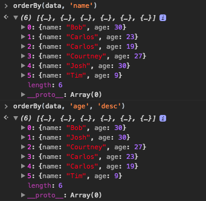
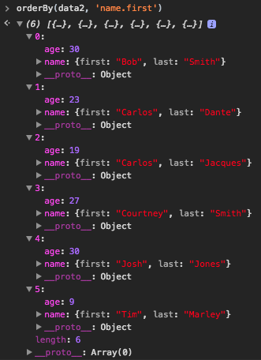
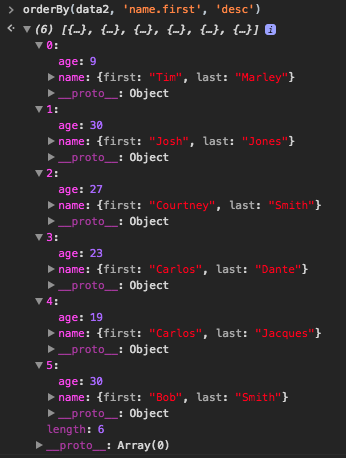

# OrderBy

```js
/**
 * orderBy
 * @param {array} arr - array object
 * @param {string} prop - object property: property - using `dot` syntax
 * @param {string} [orders] - ascending(`asc`) or descending(`desc`): 'asc' by default
 */
const orderBy = (arr, props, orders) => {
    const deepObj = obj => (~props.indexOf('.') ? props.split('.') : [props])
        .reduce((acc, key) => acc && key in acc ? acc[key] : null, obj)
    const compare = (props, orders) => {
        orders = orders === 'desc' ? -1 : 1
        return (a, b) => deepObj(a) < deepObj(b) ? orders * -1 : orders * 1
    }
    return arr.sort(compare(props, orders))
}

/******
* test data
*/
const data = [
    { name: 'Josh', age: 30 },
    { name: 'Carlos', age: 19 },
    { name: 'Carlos', age: 23 },
    { name: 'Tim', age: 9 },
    { name: 'Courtney', age: 27 },
    { name: 'Bob', age: 30 }
]
const data2 = [
    { name: { first: 'Josh', last: 'Jones' }, age: 30 },
    { name: { first: 'Carlos', last: 'Jacques' }, age: 19 },
    { name: { first: 'Carlos', last: 'Dante' }, age: 23 },
    { name: { first: 'Tim', last: 'Marley' }, age: 9 },
    { name: { first: 'Courtney', last: 'Smith' }, age: 27 },
    { name: { first: 'Bob', last: 'Smith' }, age: 30 }
]
orderBy(data, 'name')
orderBy(data, 'age', 'desc')
orderBy(data2, 'name.first')
orderBy(data2, 'name.first', 'desc')
```





[[↻ Back To Home](/)] &nbsp;
[[☝︎ Back To TOP](#orderby)]